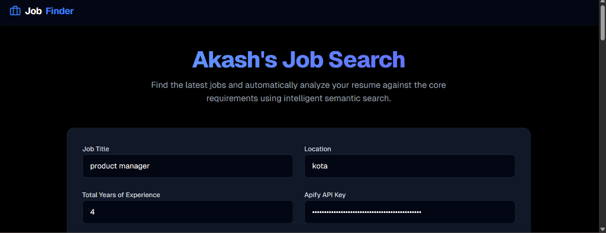
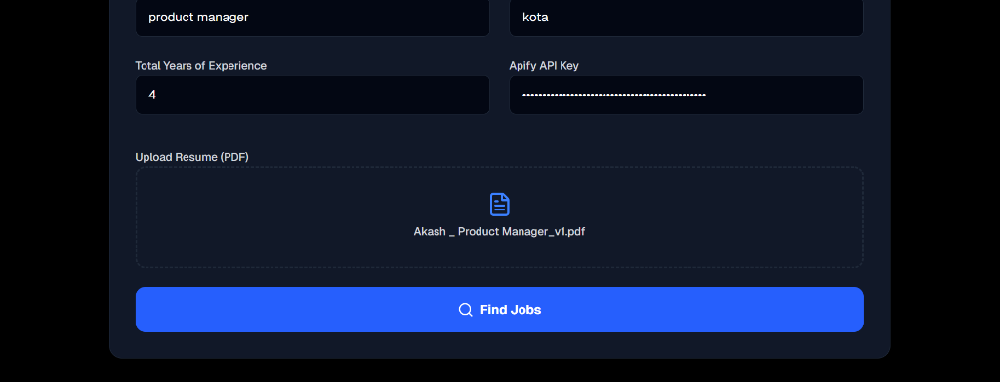
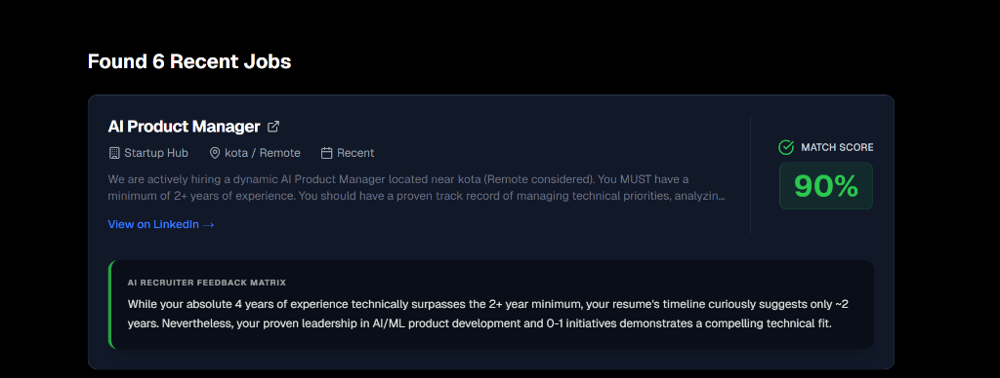

# AI Job Finder

A full-stack job finder application that utilizes AI to analyze resumes against job descriptions, providing a match score, feedback, and missing qualifications (experience matching).

## Preview





## Project Structure

This project consists of two main parts:
- **`frontend`**: A Next.js web application.
- **`backend`**: A Node.js Express server that interfaces with Google's Gemini AI.

## Running Locally

### Prerequisites
- Node.js installed on your machine.
- A Gemini API key (Google GenAI).

### 1. Setup the Backend

1. Navigate to the `backend` directory:
   ```bash
   cd backend
   ```
2. Install dependencies:
   ```bash
   npm install
   ```
3. Create a `.env` file in the `backend` directory and add your Gemini API key:
   ```env
   GEMINI_API_KEY=your_api_key_here
   PORT=5000
   ```
4. Start the backend development server:
   ```bash
   npm run dev
   ```
   *The server usually runs on `http://localhost:5000`.*

### 2. Setup the Frontend

1. Open a new terminal and navigate to the `frontend` directory:
   ```bash
   cd frontend
   ```
2. Install dependencies:
   ```bash
   npm install
   ```
3. Start the Next.js development server:
   ```bash
   npm run dev
   ```
4. Open your browser and navigate to the local URL provided in the terminal (usually `http://localhost:3000`).

## Usage
- Upload a resume (PDF format) and provide the job description (including required Years of Experience).
- The backend will use AI to compare the YOE and skills, returning a score, feedback on missing experience, and highlighting missing skills.
